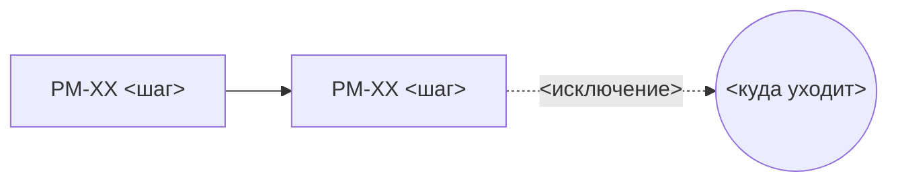

# Карта процессов: <название сквозного процесса>

Файл ведёт аналитик. Владельцы и статусы рутов — в сгенерированной сводке `_index.md`.

Одна карта — один сквозной процесс главного объекта, от появления до закрытия. Обычно у продукта одна карта.
Отдельная функциональность — это не новая карта, а декомпозиты внутри шагов.

## Главный объект
<Что движется по процессу: заявка, договор, заказ, надпись.>
Появляется: <событие, с которого объект начинает путь>
Закрывается: <события, которыми путь заканчивается>

## Схема
Основной путь слева направо, исключения пунктиром. Узел схемы = шаг = рут.

## Шаги
| ID | Шаг | Вход | Выход | Состояние объекта после шага |
|---|---|---|---|---|
| PM-00 | Каркас и общие части | — | — | — |
| PM-XX | <шаг> | <что приходит, откуда> | <что уходит, куда> | <состояние> |

## Жизненный цикл главного объекта
Заполняется после сессии по событиям. Подробно — в `core/domain-model.md`.

<состояние> → <состояние> → …

## Изменения структуры
Добавить, разделить или объединить шаги может только аналитик. Остальные пишут вопрос типа «скоуп».

| Дата | Что изменилось | Почему | Вопрос |
|---|---|---|---|
