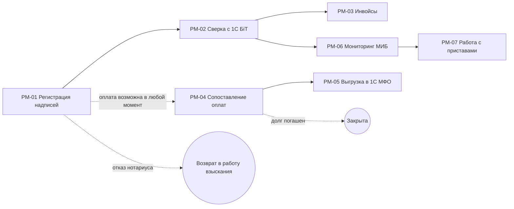

# Как строится карта процессов

Карта процессов — скелет продукта. По ней пул делит работу на руты, а руты — на декомпозиты. Если карта неверная, неверно поделится всё.

Строит карту аналитик с агентом (скилл `kb-map`). Сверяет — бизнес. Наполняет — весь пул.

## Сколько карт

**Одна карта — один сквозной процесс главного объекта**, от появления до закрытия. Почти всегда у продукта одна карта: `context/process/_map.md`.

| Ситуация | Что делаем |
|---|---|
| Новая функциональность | Не новая карта, а декомпозиты внутри шагов. «Учёт переплат» — это `PM-04-04`, а не карта |
| Шаг слишком большой, внутри свой маршрут | Делим шаг на несколько шагов той же карты |
| Второй главный объект со своим жизненным циклом | Вторая карта: `context/process/<процесс>/_map.md`. Номера шагов сквозные по продукту |

**Признак второй карты:** у объекта свои состояния от появления до закрытия, и он может жить без первого процесса. Пример: судебное взыскание рядом с внесудебным — у судебного дела свой путь, оно может начаться без исполнительной надписи.

## Новый продукт без текущего процесса

У новой идеи тоже есть «как сейчас»: люди как-то решают задачу без продукта — руками, в Excel, в мессенджере, у конкурента. Карта строится по этому пути. Материал — интервью владельца идеи и будущих пользователей (скилл `kb-init`, режим «только идея»).

Если сейчас задачу не решают никак, карта описывает задуманный путь. Это нормально, но честно:
- в «Зачем этот шаг бизнесу» пишем «шага сейчас нет: так задумано»;
- желания владельца продукта (что должно быть) — `подтверждено`: это его решение;
- цифры о мире (сколько будет пользователей, сколько они тратят времени) — `оценка`;
- перед нарезкой оценки, от которых зависит, делать ли шаг вообще, проверяют на пользователях или оформляют допущениями.

## Что такое шаг

Шаг — это переход главного объекта из одного состояния в другое. Шаг = рут = один файл `PM-XX-*.md` = один владелец.

Хороший шаг:
- у него есть вход и выход, и выход отличается от входа;
- его делает одна группа людей или одна система;
- его можно описать на одной странице;
- внутри нет своего маршрута с развилками на несколько дней.

Карта на 5–12 шагов. Меньше пяти — шаги слишком крупные, рут нельзя разобрать за неделю. Больше двенадцати — вы описываете действия, а не шаги.

## Порядок работы

### 1. Главный объект

Ответьте на три вопроса по материалам:

| Вопрос | Взыскание |
|---|---|
| Что движется по процессу от начала до конца? | Исполнительная надпись |
| Какое событие его рождает? | Договор просрочен больше порога, его включили в пакет на нотариуса |
| Какими событиями путь заканчивается? | Долг погашен; надпись отозвана; нотариус отказал |

Если на эти вопросы нет ответа — карту строить рано. Сначала вопросы бизнесу.

**Ошибка:** взять главным объектом «клиента» или «договор», потому что они есть во всех системах. Главный объект — тот, чьё состояние меняет процесс. Договор существовал до взыскания и останется после.

### 2. Состояния

Выпишите, что происходит с объектом, по порядку. Берите из скриптов (какое поле меняется), выгрузок (колонка статуса), интервью.

```
в пакете → зарегистрирована → сверена → в производстве → частично оплачена → погашена
```

### 3. Шаги

Каждый переход состояния — кандидат в шаг. Назовите его: глагол действия или отглагольное существительное + объект.

| Хорошо | Плохо | Почему плохо |
|---|---|---|
| Регистрация надписей | Работа с надписями | Не видно перехода |
| Сопоставление оплат | Бухгалтерия | Это отдел, а не шаг |
| Выгрузка в 1С МФО | 1С | Это система |
| Мониторинг МИБ | Обработка | Ничего не значит |

### 4. Ветки и исключения

- **Параллельная ветка** — отдельный шаг, не продолжение цепочки. Оплата может прийти в любой момент после регистрации, поэтому «Сопоставление оплат» — ветка, а не шаг после приставов.
- **Исключение** (отказ, возврат, отмена) — пунктир на схеме, пока внутри него нет своей работы. Появилась работа — становится шагом.

### 5. Системы и термины

- Каждая внешняя система — файл `context/systems/SYS-XX-*.md`.
- Каждый термин бизнеса — строка в `context/glossary.md`. Одно слово в двух значениях — два термина.

### 6. Оформление

Агент делает это по скиллу `kb-map`:
- `_map.md`: главный объект, схема, таблица шагов, черновой жизненный цикл;
- файлы шагов: только шапка, «Зачем» и черновые «Вход и выход»;
- `PM-00 Каркас и общие части` уже есть в шаблоне.

Как выглядит схема:



### 7. Сверка структуры с бизнесом

Встреча 30–40 минут с владельцем процесса. Бизнес проверяет **структуру**, а не содержание шагов.

Вопросы:
1. Вот шаги по порядку. Так вы работаете? Чего не хватает?
2. Где для вас начинается и где заканчивается процесс?
3. По каждому шагу: кто делает, в чём, сколько раз в день или неделю?
4. Что идёт параллельно, а что строго по очереди?
5. Где больше всего ручной работы и ошибок?

Итог — строки в «Изменения структуры» с причиной. В симуляции бизнес поправил два места: МИБ и приставы — разные шаги, оплата — параллельная ветка.

### 8. Подготовка к взятию

Руты не раздают. Аналитик готовит каждый шаг так, чтобы его мог взять любой разработчик, и останавливается (скилл `kb-map`, режим 3). На шаг — 30–60 минут.

| Аналитик заполняет | Аналитик **не** заполняет — это разбор владельца |
|---|---|
| Зачем шаг бизнесу — одна-две фразы | Как сейчас |
| Вход и выход — по одной строке | Объём и время |
| Участники — роли, хотя бы одна строка | Правила и исключения |
| Боль — если бизнес её назвал на сверке | Идентификаторы и данные |
| **Материалы и контакты** — какие файлы в `materials/` читать первыми и кто в бизнесе отвечает | |
| `приоритет` — вместе с менеджером: 1 — брать первым | |
| `людей` — 1 или 2, по подсказке `ready-check` | |

`python3 tools/kb.py ready-check PM-XX` проверяет этот минимум и подсказывает, сколько людей нужно на рут.

**Сколько людей.** Подсказка считает признаки сложности шага:

| Признак | Порог |
|---|---|
| Систем в шапке | 2 и больше |
| Скриптов и выгрузок в «Материалах» | 2 и больше |
| Ролей бизнеса в «Участниках» | 3 и больше |
| Связей шага на карте | 3 и больше |

Ни одного или один признак — 1 человек. Два-три — 2 человека. Все четыре — шаг слишком большой даже для двоих: лучше разделить. Окончательно решает аналитик и пишет в шапку `людей: 1` или `людей: 2`. Проходит — статус «Готов к взятию».

Почему аналитик не идёт глубже: разбор — это и есть работа владельца. Если аналитик опишет «Как сейчас» сам, он станет узким местом, а владелец будет пересказывать чужой пересказ вместо материалов.

### 9. Взятие

Разработчики берут руты сами — скилл `kb-take`:

```
python3 tools/kb.py ready          # готовые к взятию по приоритету
python3 tools/kb.py take PM-04     # стать владельцем, статус → Разбор
```

- **Лимит** — сколько рутов в разборе у одного человека одновременно, поле `лимит рутов на человека` в `team.md` (по умолчанию 1). Новый берут, когда свой дошёл до приёмки.
- **Приоритет** — берут сверху. Не верхний можно, но с причиной в коммите: «знаю 1С МФО».
- **Кто первый** — коммит взятия идёт прямо в основную ветку, без MR. Два человека взяли один рут — второй получит конфликт при push и возьмёт следующий.
- **Рут на двоих** — если в шапке `людей: 2`, второй берёт его той же командой `take` и становится напарником. Больше двух не бывает: третий начинает делать за других, а каждый надеется на соседа. Шаг слишком большой для двоих — аналитик делит его.
- **Вернуть** — `python3 tools/kb.py release PM-04 "<почему>"`. Факты и вопросы остаются, рут снова «Готов к взятию».
- **Системы** — так же: `take SYS-03`. Удобно брать вместе с рутом, где система главная.
- `PM-00` (каркас и общие части) берёт техлид потока: `take PM-00`. Для него нет проверки готовности, и он не считается в лимит.

## Изменение структуры потом

Структуру меняет только аналитик. Остальные — вопрос типа «скоуп».

| Что | Как |
|---|---|
| Добавить шаг | Следующий свободный номер, даже если шаг встаёт в середину. Порядок — в поле `порядок` |
| Разделить шаг | Старый ID остаётся у первой части, вторая — новый номер |
| Объединить шаги | Остаётся меньший ID, ссылки переносятся, номер второго больше не используется. Если есть декомпозиты — решает архитектор недели |
| Переименовать | ID остаётся |

**ID никогда не переиспользуется.** Каждое изменение — строка в «Изменения структуры»: дата, что, почему, вопрос.

## Карта картинкой

Схему не рисуют руками. Её рисует `python3 tools/kb.py map` по блоку mermaid в `_map.md`, статусам и журналу. То же делает `kb.py index`, а значит, и CI после каждого слияния: картинка всегда свежая.

| Файл | Что это | Где смотреть |
|---|---|---|
| `context/process/_map.svg` | Картинка: шаги с цветом статуса, владельцы, значки открытых вопросов (?), допущений (A), рисков (R), декомпозиты готово/всего, ветки и исключения пунктиром | В GitLab прямо в файле и в `_index.md`; вставляется в презентации и Confluence |
| `context/process/_map.html` | Интерактивная схема: по клику на шаг — «Зачем», боль, открытые вопросы, допущения, риски, декомпозиты | Открыть в браузере; работает без интернета |

Эти файлы генерируются: руками их не правят. Поменять картинку — поменять `_map.md` или файлы шагов.

## Где что живёт

| Что | Где | Почему там |
|---|---|---|
| Структура: шаги, порядок, связи | `_map.md` | Пишет только аналитик, правок мало — нет конфликтов |
| Содержание шага | `PM-XX-*.md` | Пишет только владелец рута |
| Владельцы, статусы, число вопросов | `_index.md` | Генерируется `kb.py index` — никто не правит руками |

## Карта готова к раздаче, когда

- [ ] Главный объект назван, известно, что его рождает и чем путь заканчивается.
- [ ] 5–12 шагов, у каждого вход, выход и состояние после.
- [ ] Параллельные ветки и исключения на схеме.
- [ ] Внешние системы — файлами, термины — в глоссарии.
- [ ] Бизнес подтвердил структуру на встрече, правки записаны.
- [ ] `python3 tools/kb.py check` — ошибок 0.

## Карта готова для первых декомпозитов, когда

По каждому шагу можно ответить:
- кто и в чём работает с объектом;
- сколько этого и как часто;
- где теряются время и деньги;
- какие данные рождаются и кто источник правды.

Это делает пул скиллом `kb-explore`, по направлениям из [thinking.md](thinking.md).
